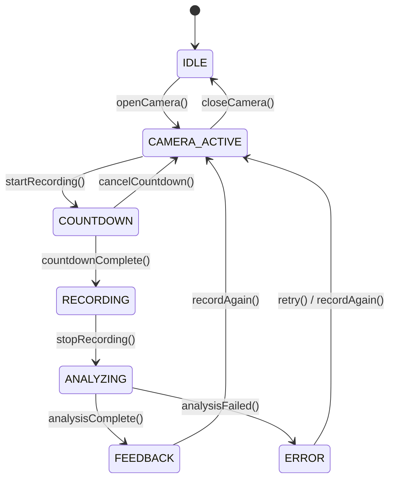

# Design Document: Gym Form Checker

## Overview

Gym Form Checker is an MVP web application that lets a user record themselves performing a gym exercise via their device camera, then receive AI-assisted form feedback. The system is split into a browser-based frontend and a Python backend.

The core user journey is:

1. Open camera → see live preview
2. Click "Start Recording" → 10-second countdown overlay
3. Countdown reaches zero → recording begins automatically
4. Click "Stop Recording" (or 120-second auto-stop) → video is finalized
5. Video is uploaded to the backend → pose analysis runs
6. Feedback report (score + observations + suggestions) is displayed

The MVP deliberately avoids real-time streaming analysis; the backend processes the complete video clip after recording ends, keeping the architecture simple and the analysis deterministic.

---

## Architecture

The system follows a two-tier architecture: a static frontend served by the Python backend, and a REST API for video upload and analysis.

```mermaid
graph TD
    subgraph Browser
        UI[Frontend SPA<br/>HTML + CSS + JS]
        CAM[Camera / MediaRecorder API]
        UI -- getUserMedia --> CAM
        CAM -- Blob chunks --> UI
    end

    subgraph Python Backend (FastAPI)
        STATIC[Static File Server]
        API[REST API<br/>/api/analyze]
        ANALYZER[Pose Analyzer]
        VALIDATOR[Video Validator]
        API --> VALIDATOR
        VALIDATOR --> ANALYZER
    end

    UI -- GET / --> STATIC
    UI -- POST /api/analyze (multipart) --> API
    API -- JSON Feedback_Report --> UI
```

**Technology choices:**

| Layer | Technology | Rationale |
|---|---|---|
| Frontend | Vanilla HTML/CSS/JS | No build toolchain needed for MVP; keeps deployment simple |
| Backend framework | FastAPI (Python) | Async-friendly, automatic OpenAPI docs, clean `UploadFile` support |
| Pose estimation | MediaPipe BlazePose | 33-landmark model, runs on CPU, well-documented Python API |
| Video decode | OpenCV (`cv2.VideoCapture`) | Standard choice for frame-by-frame video processing in Python |
| Browser recording | `MediaRecorder` API | Native browser API; produces WebM/MP4 blobs without extra libraries |

---

## Components and Interfaces

### Frontend Components

```
frontend/
  index.html          # Single-page app shell
  css/
    style.css         # All styles
  js/
    camera-manager.js # Camera open/close, getUserMedia
    recorder.js       # MediaRecorder wrapper, countdown timer
    uploader.js       # Fetch-based multipart upload
    feedback-ui.js    # Render Feedback_Report to DOM
    app.js            # Top-level state machine, wires components together
```

#### State Machine

The frontend is driven by a simple state machine with these states:



#### CameraManager

```javascript
/**
 * Manages camera stream lifecycle.
 * @param {HTMLVideoElement} videoEl - The preview element.
 */
class CameraManager {
  async open()   // calls getUserMedia, attaches stream to videoEl
  close()        // stops all tracks, clears srcObject
  getStream()    // returns the active MediaStream or null
}
```

#### Recorder

```javascript
/**
 * Wraps MediaRecorder with countdown logic.
 * @param {MediaStream} stream
 * @param {object} options - { countdownSeconds, maxDurationSeconds }
 */
class Recorder {
  startCountdown(onTick, onComplete, onCancel)
  cancelCountdown()
  startRecording(onStop)   // called automatically when countdown ends
  stopRecording()          // manual stop; also called by auto-stop timer
  getBlob()                // returns the recorded Blob
}
```

MIME type selection order: `video/mp4` → `video/webm;codecs=vp9` → `video/webm` (first supported by `MediaRecorder.isTypeSupported`).

#### Uploader

```javascript
/**
 * Uploads a video Blob to the analysis endpoint.
 * @param {Blob} blob
 * @param {string} mimeType
 * @returns {Promise<FeedbackReport>}
 */
async function uploadVideo(blob, mimeType)
```

Sends `multipart/form-data` with field name `video_clip`. Throws on HTTP error or network failure.

#### FeedbackUI

```javascript
/**
 * Renders a FeedbackReport into the feedback section of the DOM.
 * @param {FeedbackReport} report
 */
function renderFeedback(report)

/**
 * Clears the feedback section.
 */
function clearFeedback()
```

---

### Backend Components

```
backend/
  main.py               # FastAPI app, mounts static files, registers routes
  api/
    routes.py           # POST /api/analyze endpoint
  analyzer/
    pose_analyzer.py    # PoseAnalyzer class: frame extraction + landmark detection
    form_scorer.py      # FormScorer class: angle computation + heuristic scoring
    feedback_builder.py # FeedbackBuilder class: assembles Feedback_Report
  models/
    feedback.py         # Pydantic models: FeedbackReport, Observation, Suggestion
  validation/
    video_validator.py  # VideoValidator: format + size checks
  config.py             # Settings loaded from environment variables
```

#### POST /api/analyze

```
POST /api/analyze
Content-Type: multipart/form-data

Field: video_clip (file)

Response 200:
{
  "form_score": 78,
  "positive_observations": ["string", ...],
  "improvement_suggestions": ["string", ...]
}

Response 400: { "detail": "string" }   # validation failure
Response 422: { "detail": "string" }   # unprocessable (too short, etc.)
Response 500: { "detail": "string" }   # analysis error
```

#### VideoValidator

```python
class VideoValidator:
    """Validates an uploaded video file before analysis."""

    SUPPORTED_MIME_TYPES: frozenset[str]  # video/mp4, video/webm, video/quicktime
    MAX_FILE_SIZE_BYTES: int              # 100 MB

    def validate(self, file_bytes: bytes, content_type: str) -> None:
        """
        Validates format and size.
        Raises VideoValidationError on failure.
        """
```

#### PoseAnalyzer

```python
class PoseAnalyzer:
    """
    Extracts per-frame pose landmarks from a video file using MediaPipe BlazePose.
    """

    def analyze_video(self, video_path: str) -> list[FrameLandmarks]:
        """
        Opens the video with OpenCV, runs MediaPipe Pose on each frame,
        and returns a list of per-frame landmark data.

        Returns an empty list for frames where no pose is detected.
        """
```

`FrameLandmarks` is a dataclass holding the 33 normalized (x, y, z, visibility) landmark tuples for one frame.

#### FormScorer

```python
class FormScorer:
    """
    Computes joint angles from landmark sequences and produces a Form_Score
    with observations and suggestions using heuristic thresholds.
    """

    def score(self, frames: list[FrameLandmarks]) -> ScoringResult:
        """
        Aggregates landmark sequences, computes angle time series for key joints,
        compares against ideal ranges, and returns a ScoringResult.
        """
```

Joint angle computation uses the standard three-point vector formula:

```
angle(A, B, C) = arccos( (BA · BC) / (|BA| × |BC|) )
```

where B is the vertex joint (e.g., knee), A and C are the adjacent joints (hip and ankle).

Key joints assessed (generic, exercise-agnostic for MVP):
- Left/right knee angle (hip → knee → ankle)
- Left/right hip angle (shoulder → hip → knee)
- Left/right elbow angle (shoulder → elbow → wrist)
- Spine alignment (shoulder midpoint → hip midpoint vertical deviation)

#### FeedbackBuilder

```python
class FeedbackBuilder:
    """Assembles a FeedbackReport from a ScoringResult."""

    def build(self, result: ScoringResult) -> FeedbackReport:
        """
        Maps score ranges and flagged joints to human-readable
        positive observations and improvement suggestions.
        Guarantees at least one positive observation and one suggestion.
        """
```

---

## Data Models

### Frontend (JavaScript)

```javascript
/**
 * @typedef {object} FeedbackReport
 * @property {number} form_score - 0–100 numeric score
 * @property {string[]} positive_observations - What the user did well
 * @property {string[]} improvement_suggestions - Actionable improvements
 */
```

### Backend (Python / Pydantic)

```python
from pydantic import BaseModel, Field

class FeedbackReport(BaseModel):
    """Structured output of the Analyzer."""
    form_score: int = Field(..., ge=0, le=100)
    positive_observations: list[str] = Field(..., min_length=1)
    improvement_suggestions: list[str] = Field(..., min_length=1)

class FrameLandmarks:
    """Pose landmarks for a single video frame."""
    frame_index: int
    landmarks: list[tuple[float, float, float, float]]  # (x, y, z, visibility) × 33

class ScoringResult:
    """Intermediate result from FormScorer before human-readable text is added."""
    form_score: int                          # 0–100
    flagged_joints: list[str]               # joints outside ideal range
    well_performed_joints: list[str]        # joints within ideal range
    angle_summaries: dict[str, float]       # joint_name → mean angle (degrees)
```

### Environment Configuration

All runtime configuration is loaded from environment variables via `config.py`:

| Variable | Description | Default |
|---|---|---|
| `MAX_VIDEO_SIZE_MB` | Maximum upload size in MB | `100` |
| `MIN_CLIP_DURATION_SEC` | Minimum clip duration in seconds | `3` |
| `MAX_CLIP_DURATION_SEC` | Maximum recording duration in seconds | `120` |
| `MEDIAPIPE_MODEL_COMPLEXITY` | BlazePose model complexity (0, 1, or 2) | `1` |
| `TEMP_UPLOAD_DIR` | Directory for temporary video files | `/tmp` |

No secrets are hardcoded; the config module raises a clear error at startup if required variables are missing.

---

## Correctness Properties

*A property is a characteristic or behavior that should hold true across all valid executions of a system — essentially, a formal statement about what the system should do. Properties serve as the bridge between human-readable specifications and machine-verifiable correctness guarantees.*

### Property 1: Countdown fires exactly N ticks in descending order then completes

*For any* integer countdown duration N ≥ 1, the `Recorder.startCountdown` method SHALL invoke the `onTick` callback exactly N times with values N, N-1, …, 1 (in that order), and then invoke `onComplete` exactly once.

**Validates: Requirements 2.2, 2.3, 2.5**

---

### Property 2: Short clip is always rejected without invoking the analyzer

*For any* video clip whose computed duration is strictly less than `MIN_CLIP_DURATION_SEC` (3 seconds), the analysis endpoint SHALL return a 422 response and SHALL NOT invoke `PoseAnalyzer.analyze_video`.

**Validates: Requirements 4.5**

---

### Property 3: Form score is always within the valid range

*For any* non-empty sequence of `FrameLandmarks` passed to `FormScorer.score`, the `form_score` in the returned `ScoringResult` SHALL be an integer in the range [0, 100] inclusive.

**Validates: Requirements 5.1**

---

### Property 4: FeedbackReport always contains at least one positive observation and one improvement suggestion

*For any* `ScoringResult` passed to `FeedbackBuilder.build`, the returned `FeedbackReport` SHALL contain at least one entry in `positive_observations` AND at least one entry in `improvement_suggestions`.

**Validates: Requirements 5.2, 5.3**

---

### Property 5: Rendered feedback always contains all required labeled sections

*For any* valid `FeedbackReport` passed to `renderFeedback`, the resulting DOM SHALL contain a labeled section for the Form_Score, a labeled section for positive observations, and a labeled section for improvement suggestions.

**Validates: Requirements 5.4**

---

### Property 6: Unsupported MIME type is always rejected without processing

*For any* MIME type string not in `SUPPORTED_MIME_TYPES`, `VideoValidator.validate` SHALL raise a `VideoValidationError` and `PoseAnalyzer.analyze_video` SHALL NOT be called.

**Validates: Requirements 6.1, 6.3**

---

### Property 7: Oversized file is always rejected without processing

*For any* file whose byte length exceeds `MAX_FILE_SIZE_BYTES` (100 MB), `VideoValidator.validate` SHALL raise a `VideoValidationError` and `PoseAnalyzer.analyze_video` SHALL NOT be called.

**Validates: Requirements 6.2, 6.3**

---

### Property 8: Joint angle computation is symmetric

*For any* three 3D points A, B, C, the angle computed at vertex B SHALL equal the angle computed at vertex B when A and C are swapped: `compute_angle(A, B, C) == compute_angle(C, B, A)` within floating-point tolerance (1e-9 degrees).

**Validates: Requirements 4.3** (internal correctness of the analysis engine)

---

## Error Handling

| Scenario | Frontend Behavior | Backend Behavior |
|---|---|---|
| Camera permission denied | Display error: "Camera access is required. Please allow camera permission and try again." | N/A |
| No camera device found | Display error: "No camera was found on this device." | N/A |
| Video capture error during recording | End session, discard clip, display error message | N/A |
| Clip too short (< 3 s) | Display message: "Recording is too short. Please record for at least 3 seconds." | Return 422 |
| File too large (> 100 MB) | (Checked client-side before upload) Display error | Return 400 |
| Unsupported format | (Checked client-side) Display error | Return 400 |
| Analyzer failure | Display error + "Retry" button | Return 500 with detail |
| Network error during upload | Display error + "Retry" button | N/A |

**Retry logic:** The frontend offers a "Retry Analysis" button on analyzer failure (Requirement 4.4). Retrying re-submits the same `Blob` without re-recording.

**Temporary file cleanup:** The backend writes the uploaded video to a temp file, processes it, then deletes it in a `finally` block regardless of success or failure.

---

## Testing Strategy

### Unit Tests

Unit tests live alongside source files in `__tests__` (JS) and `tests/unit/` (Python).

**Python unit tests (pytest):**
- `VideoValidator`: valid/invalid MIME types, boundary file sizes (exactly 100 MB, 100 MB + 1 byte)
- `FormScorer`: known landmark sequences with expected angle outputs; score boundary conditions (all joints perfect → 100, all joints bad → low score)
- `FeedbackBuilder`: verify at least one positive observation and one suggestion for any `ScoringResult`
- `FeedbackReport` Pydantic model: field validation (score out of range, empty lists)

**JavaScript unit tests (Jest or Vitest):**
- `CameraManager`: mock `getUserMedia` success/denial/no-device
- `Recorder`: countdown tick sequence, cancel mid-countdown, auto-stop at max duration
- `Uploader`: mock `fetch`, verify multipart body, error propagation
- `FeedbackUI`: DOM rendering with sample report data

### Property-Based Tests

Property-based tests use **Hypothesis** (Python) and **fast-check** (JavaScript), each configured to run a minimum of 100 iterations.

Each test is tagged with a comment referencing its design property:
```
# Feature: gym-form-checker, Property N: <property text>
```

**Python property tests (Hypothesis):**

- **Property 2** — Short clip rejection: generate video durations in [0, `MIN_CLIP_DURATION_SEC`); assert the endpoint returns 422 without calling `PoseAnalyzer`.
- **Property 3** — `FormScorer` score is always in [0, 100]: generate random `FrameLandmarks` sequences; assert `0 <= score <= 100`.
- **Property 4** — `FeedbackBuilder` always produces at least one observation and suggestion: generate arbitrary `ScoringResult` instances; assert both lists are non-empty.
- **Property 6** — `VideoValidator` rejects unsupported formats: generate arbitrary MIME type strings not in `SUPPORTED_MIME_TYPES`; assert `VideoValidationError` is raised and `PoseAnalyzer` is not called.
- **Property 7** — `VideoValidator` rejects oversized files: generate byte lengths > `MAX_FILE_SIZE_BYTES` with valid MIME types; assert `VideoValidationError` is raised and `PoseAnalyzer` is not called.
- **Property 8** — Joint angle symmetry: generate random triplets of 3D points; assert `compute_angle(A, B, C) == compute_angle(C, B, A)` within 1e-9 degrees tolerance.

**JavaScript property tests (fast-check):**

- **Property 1** — Countdown fires exactly N ticks in order: generate integer N in [1, 60]; assert `onTick` is called N times with values N, N-1, …, 1 in order, then `onComplete` once.
- **Property 5** — Rendered feedback contains all required sections: generate random `FeedbackReport` objects; call `renderFeedback`; assert DOM contains score, observations, and suggestions labeled sections.

### Integration Tests

Integration tests live in `tests/integration/` and test the full request/response cycle against a running FastAPI test client (`httpx.AsyncClient`).

- Upload a real short video clip (< 3 s) → expect 422
- Upload a video exceeding 100 MB → expect 400
- Upload a valid 5-second clip with a visible person → expect 200 with a well-formed `FeedbackReport`
- Upload a file with an unsupported MIME type → expect 400

### Test Coverage Target

Aim for > 80% coverage on all business logic modules (`analyzer/`, `validation/`, `models/`).
